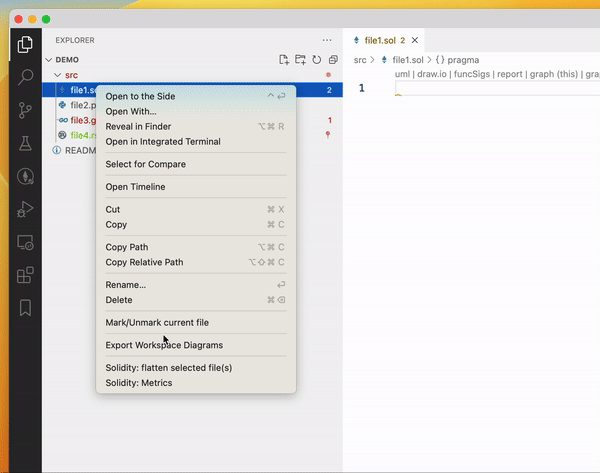
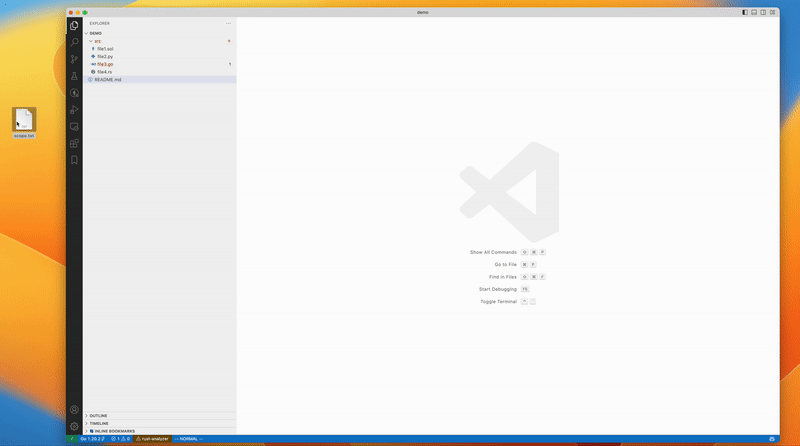

# Mark Files

**Mark Files** is a cute vscode extension that enables to mark files in the file explorer.

## Features

The extension allows you to mark/unmark files by:

- Providing a `scope.txt` file in the workspace root folder. The file contains a list of patterns for files to include in the scope. The patterns are written using the [.gitignore format](https://git-scm.com/docs/gitignore#_pattern_format), e.g., `**.sol` to include all Solidity files in all directories.
- Selecting a single/multiple files/folders in the explorer and clicking on `Mark/Unmark File` from the context menu.
- Right clicking on an editor tab and selecting `Mark/Unmark File` from the context menu.

Note that the marked files are stored in the workspace local storage. In case of mulit-root workspaces, if you don't save the workspace, the marks will be discarded if the workspace is closed. You can also export the marked files to a file on disk by invoking the `Export maked files to a file` command. For multi-root workspaces, marked files will be exported to individual files located at the root of each opened foler. Marked files exported to disk can be re-imported by naming the export file as `scope.txt`, and using the import feature.

### Mark/Unmark files from contextual menus



### Import marks from `scope.txt` file



## Extension Settings

This extension contributes the following settings:

- `markfiles.colorMarkedFile`: Choose whether to mark files by adding an icon, changing the color of the file name or both.
- `markfiles.markedFileIcon`: Choose the symbol to use for marked files. Note that the symbol must be a single unicode character.

The color used to mark files can be changed by modifying the following key in your `settings.json` file:

```json
"workbench.colorCustomizations": {
    "markfiles.markedFileColor": "#7ad108"
}
```

## Release Notes

Check [CHANGELOG.md](CHANGELOG.md)
